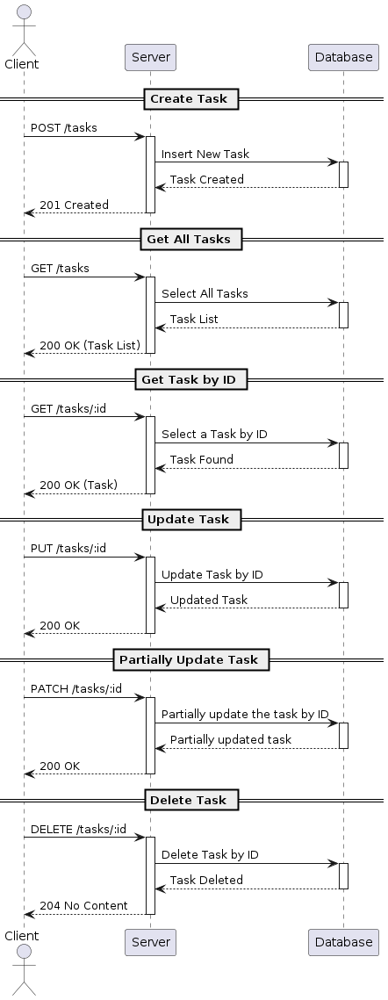
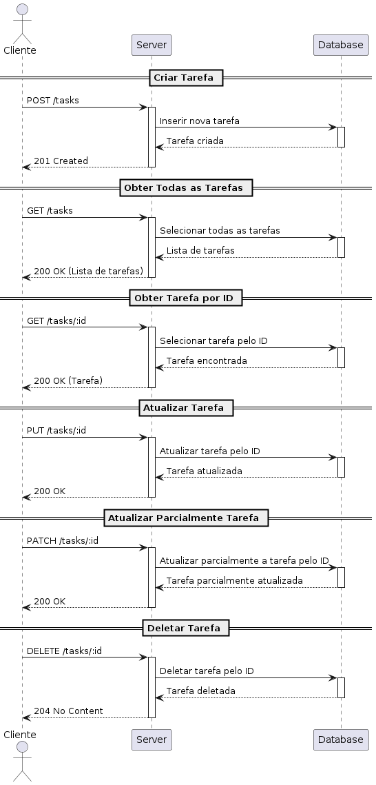

README in [🇺🇸 (en-US)](#nodejs-crud-api-challange-project)
LEIAME em [🇧🇷 (pt-BR)](#api-crud-de-desafio-nodejs)

# NodeJS CRUD API Challange Project 

## A simple challange project written in JavaScript with NodeJS to manage tasks!

This project represents a challenge proposed by the NodeJS track of the Rocketseat course. The objective is to create a CRUD API for task management that is capable of: 

- [x] Creating a task.

- [x] Listing all tasks.

- [x] Update tasks by ID.

- [x] Delete tasks by ID.

- [x] Mark a task as 'complete' by ID.

- [] Importing tasks in bulk via a CSV file.

## UML chart 

The following UML activity diagram is intended to facilitate a more comprehensive understanding of the API and its functionalities.

## How to install and use

If you want to test out all the different features of the API, the best way to do it is with a tool like Insomnia or Postman. With Insomnia as a base, we can: 

1. clone the repository to your machine.

2. Start the server with `npm run dev`.

3. In insomnia, create a new collection and make an HTTP request to `http://localhost:3334/tasks`. There are five possible routes: 

 - POST ("/tasks"): To create a new task and save it.

 - GET ("/tasks/:id"): You can search for all tasks in the database or for a specific one by its ID by adding `/yourID` to the end of the URL.

 - PATCH ("/tasks/:id"): To update only the task's completed status, you'll need to pass the ID of the task you want to change as the second search parameter.

 - PUT ("/tasks/:id"): To change the task completely—that is, its name and description—you also need to pass the ID of the task you want to change.

 - DELETE ("/tasks/:id"): To delete a task.

## Contribution

You're welcome to contribute however you see fit! Just open a pull request.

## Know issues (Work in progress)

I am still in the process of learning and the project will undergo some changes and improvements. The most significant of these is the key to the challenge, which is the importation of CSV files in bulk. I can assure you that this will be resolved in due course.

___

# API CRUD de Desafio NodeJS 

## Um projeto de desafio simples escrito em JavaScript com NodeJS para gerir tarefas!

Este projeto representa um desafio proposto pela trilha de NodeJS do curso da Rocketseat. O objetivo é criar uma API CRUD para gerenciamento de tarefas que seja capaz de: 

- [x] Criar uma tarefa.

- [x] Listar todas as tarefas.

- [x] Atualizar tarefas por ID.

- [x] Deletar tarefas por ID.

- [x] Marcar uma tarefa como “concluída” por ID.

- [] Importação de tarefas em massa através de um arquivo CSV.

## Diagrama UML 

O diagrama UML a seguir tem como objetivo facilitar a compreensão de forma mais abrangente da API e das suas funcionalidades.

## Como instalar e utilizar

Se quiser testar todas as diferentes funcionalidades da API, a melhor forma é com uma ferramenta cliente para API's REST como o Insomnia ou o Postman. Com o Insomnia como base, podemos: 

1. clonar o repositório para sua máquina.

2. Iniciar o servidor com `npm run dev`.

3. No insomnia, criar uma nova coleção e fazer uma requisição HTTP na URL `http://localhost:3334/tasks`. Existem cinco rotas possíveis: 

 - POST ("/tasks"): Para criar uma nova tarefa.

 - GET ("/tasks/:id"): Para buscar todas as tarefas no banco de dados ou uma tarefa específica pelo seu ID, adicionando `/seuID` ao final do URL.

 - PATCH ("/tasks/:id"): Para atualizar apenas a chave "concluído" da tarefa, é necessário passar o ID da tarefa que deseja alterar como segundo parâmetro da URL.

 - PUT ("/tasks/:id"): Para alterar completamente a tarefa, ou seja, o seu nome e descrição.

 - DELETE ("/tasks/:id"): Para excluir uma tarefa.

## Contribuição

Você é bem-vindo para contribuir da maneira que achar melhor! Basta abrir um pull request.

## Conhecer problemas (Trabalho em andamento)

Ainda estou em processo de aprendizagem e o projeto vai sofrer algumas alterações e melhorias. A mais significativa delas é a chave do desafio, que é a importação de arquivos CSV em massa. Posso assegurar que esse problema será resolvido a seu tempo.

Obrigado pela atenção :)